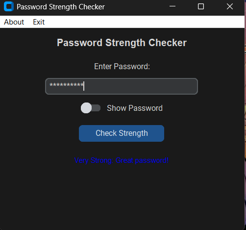

# Password-Checker


A simple and interactive Password Strength Checker application built with Python using the `customtkinter` library. This app provides an intuitive UI to check the strength of your passwords and helps you create stronger passwords by evaluating their complexity.

## Features

- **Password Strength Evaluation**:
  - Checks the complexity of a password based on its length, use of uppercase letters, lowercase letters, numbers, and special characters.
  - Displays strength levels:
    - Weak
    - Moderate
    - Strong
    - Very Strong

- **Password Visibility Toggle**:
  - Allows users to show or hide the entered password.

- **Keyboard Shortcut**:
  - Press **Enter** in the password field to check the password strength instantly.

- **Menu Bar**:
  - **About**: Displays information about the application.
  - **Exit**: Closes the application.

## Installation

1. Clone this repository or download the source code:
   ```bash
   git clone https://github.com/tansique-17/password-checker.git
   ```

2. Navigate to the project directory:
   ```bash
   cd password-checker
   ```

3. Install the required dependencies:
   ```bash
   pip install customtkinter
   ```

4. Run the application:
   ```bash
   python passcheck.py
   ```

## Usage

1. Enter a password in the input field.
2. Press the **Check Strength** button or hit the **Enter** key to evaluate the password.
3. Toggle the **Show Password** switch to see or hide the entered password.
4. Access the **About** and **Exit** options from the menu bar for app information and to close the app.

## Password Strength Criteria

- **Weak**: Password is less than 6 characters or lacks variety.
- **Moderate**: Includes at least two of the following: uppercase letters, lowercase letters, numbers, or special characters.
- **Strong**: Includes three of the above criteria.
- **Very Strong**: Includes all four criteria.

## Screenshots


)

## Requirements

- Python 3.7 or higher
- `customtkinter` library

## Contributing

Contributions are welcome! Feel free to fork this repository, make changes, and submit a pull request.

## License

This project is licensed under the MIT License. See the [LICENSE](./LICENSE) file for details.

## Credits

Developed with ❤️ using Python and `customtkinter`.
